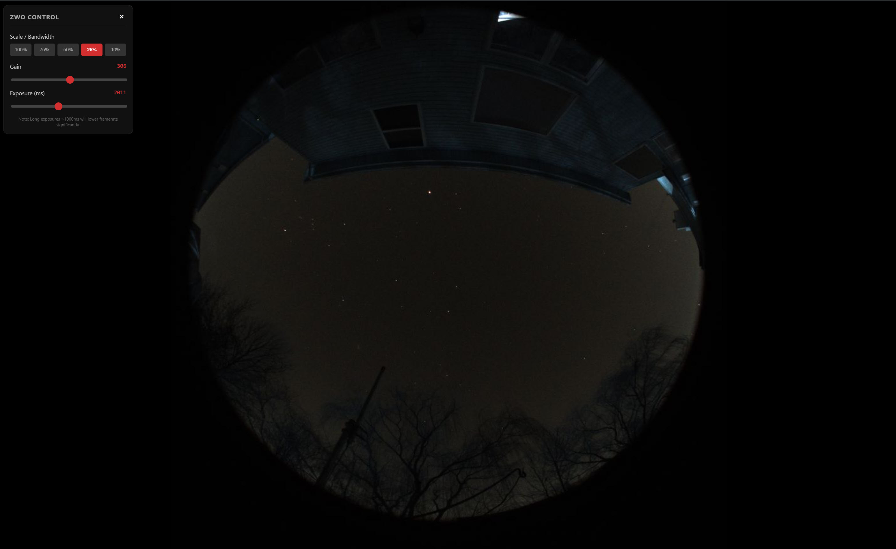

# ZWO  Camera Web Streamer 

A lightweight, headless Python solution to stream near real-time video from ZWO ASI cameras to a web browser. Designed for Raspberry Pi 5 (running Raspberry Pi OS Bookworm 64-bit) over SSH, with no window manager required.



## Features
* **Web-based View:** View the camera feed on any device (phone/laptop) via `http://<PI_IP>:5000`.
* **Headless:** Runs entirely via terminal/SSH; no HDMI monitor or X11/Wayland desktop needed.
* **MJPEG Streaming:** Low-latency video feed utilizing Flask and OpenCV.
* **Automated Setup:** Includes a script to handle virtual environments and dependencies automatically.

## Prerequisites
* **Camera:** ZWO ASI Camera (USB 3.0 recommended).
* **Drivers:** ZWO ASI SDK (Required for the `.so` library file).

## Installation

### 1. Clone/Setup Directory
Clone this repository or create a directory for your scripts:

```bash
mkdir -p ~/allsky_focusaid_stream
cd ~/allsky_focusaid_stream
```

### 2. Copy the ZWO Library
This script requires the compiled C library `libASICamera2.so` to communicate with ZWO cameras. You must extract the ZWO SDK and copy the appropriate ARMvX library to this folder based on the Pi you have. The repo has the ARMv8 version included that are suitable for Pi4 and 5.

ZWO SDK URL: https://dl.zwoastro.com/software?app=DeveloperCameraSdk&platform=windows86&region=Overseas

Based on the standard extraction path of the library in the SDK, copy the correct library:

```bash
cp ASI_Camera_SDK/ASI_Camera_SDK/ASI_linux_mac_SDK_V1.41/ASI_linux_mac_SDK_V1.41/lib/armv8/libASICamera2.so .
```

> **Note:** If your extracted SDK path differs, simply locate the `libASICamera2.so` file inside the `lib/armv8` (or the folder suitable for your Pi version) folder of the SDK and copy it into the `~/allsky_focusaid_stream` directory.

### 3. Make the Script Executable
Ensure the setup script has permission to run:

```bash
chmod +x pi_zwo_streamer.sh
```

## Usage

### Option A: Automatic Launch (Recommended)
The `pi_zwo_streamer.sh` script is an all-in-one tool. It will:
1. Check for system dependencies (OpenCV).
2. Create/Activate a Python Virtual Environment (`venv`).
3. Install Python libraries (`zwoasi`, `flask`, `opencv`).
4. Generate the streaming script (`zwo.py`).
5. Launch the stream.

To run it:
```bash
./pi_zwo_streamer.sh
```

### Option B: Manual Run
If you have already run the setup once and just want to restart the stream:

```bash
# 1. Activate the virtual environment
source venv/bin/activate

# 2. Run the python script directly
python zwo.py
```

## Viewing the Stream
1.  Ensure your computer or smartphone is on the same local network as the Pi.
2.  Find your Pi's IP address by running: `hostname -I`
3.  Open a web browser and navigate to:
    `http://<YOUR_PI_IP>:5000`
    
    *(Example: `http://192.168.1.50:5000`)*

## Configuration
To change camera settings (Exposure, Gain, High Speed Mode), edit the generated `zwo.py` file:

```bash
nano zwo.py
```

Look for the configuration block near the top:

```python
# Camera Settings
GAIN = 300            # Range: 0 to ~600 (Higher = Brighter/Noisier)
EXPOSURE_US = 20000   # Exposure in microseconds (20000 = 20ms)
```

## Troubleshooting

| Issue | Solution |
| :--- | :--- |
| **ModuleNotFoundError** | You are not in the virtual environment. Run `source venv/bin/activate` or use `./setup_zwo.sh`. |
| **Error initializing library** | The `libASICamera2.so` file is missing. Ensure it is in the same folder as `zwo.py`. |
| **No cameras found** | Check USB connection. Try a USB 3.0 (blue) port. Ensure your power supply (27W) is sufficient. |
| **Black Image** | Increase `GAIN` or `EXPOSURE_US` in the script settings. |
